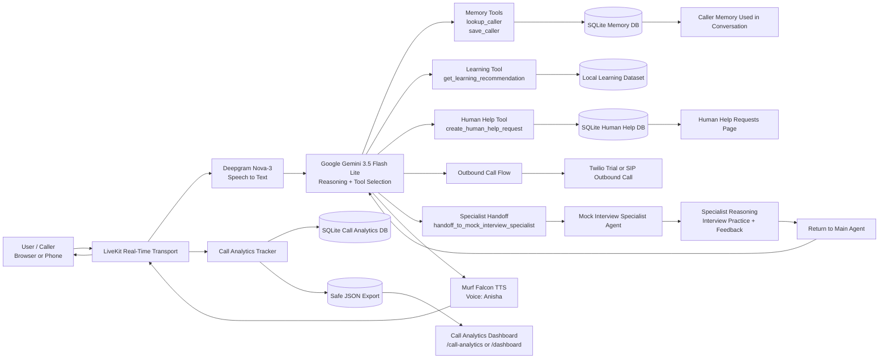

# Day 10 Architecture Diagram

Use this diagram in the Day 10 blog post for the Student Career Guide voice agent.

Caption:

> Architecture overview of the Student Career Guide voice agent. Audio flows through LiveKit, speech is transcribed by Deepgram, the LLM decides whether to answer directly or call a tool, Murf Falcon speaks the result, and local stores keep memory, analytics, and escalation data safe.
